# Sentinel 🛡️


**Sentinel** is a professional-grade, asynchronous Solana Wallet Tracker built with Python. designed to monitor blockchain activity in real-time.


## 🚀 Features

- **Real-time Monitoring**: Asynchronous polling of Solana addresses using `solana-py` and `asyncio`.
- **Downtime-Resilient**: Robust error handling ensuring the bot keeps running even if RPC nodes flicker.
- **Modular Architecture**: Clean separation between Monitoring logic, Notification systems, and Configuration.
- **Extensible Notification System**: Currently supports Console logging, with architecture ready for Telegram, Discord, or Slack integration.
- **Secure Configuration**: Uses `.env` for managing sensitive data and environment-specific settings.

## 🏗️ Architecture


## 🧠 Monitoring Logic Flow

This diagram illustrates how Sentinel's intelligent polling engine processes data every cycle:

```mermaid
graph TD
    Start((Start Loop)) --> Sleep[Wait Poll Interval]
    Sleep --> FetchSOL[Fetch SOL Balance]
    
    FetchSOL --> CheckSOL{Changed?}
    CheckSOL -- Yes --> AlertSOL["📢 Alert: SOL Update"]
    CheckSOL -- No --> FetchTokens
    AlertSOL --> FetchTokens
    
    FetchTokens[Fetch SPL Token Accounts] --> Parse[Parse JSON Data]
    Parse --> LoopTokens[Iterate Each Token]
    
    LoopTokens --> CheckToken{Balance Changed?}
    CheckToken -- Yes --> AlertToken["📢 Alert: Token Update"]
    CheckToken -- No --> NextToken
    AlertToken --> NextToken
    
    NextToken{More Tokens?} -- Yes --> LoopTokens
    NextToken -- No --> SaveState[Update Previous State]
    SaveState --> Sleep
```



## 🛠️ Installation

1. **Clone the repository** (if applicable) or navigate to the project folder:
   ```bash
   cd sentinel
   ```

2. **Create and activate a virtual environment**:
   ```bash
   python3 -m venv venv
   source venv/bin/activate  # On Windows: venv\Scripts\activate
   ```

3. **Install dependencies**:
   ```bash
   pip install -r requirements.txt
   ```

## ⚙️ Configuration

1. Copy the example environment file:
   ```bash
   cp .env.example .env
   ```

2. Edit `.env` with your desired settings:
   ```ini
   # Node RPC URL (Use Devnet for testing, Mainnet for production)
   SOLANA_RPC_URL=https://api.devnet.solana.com
   
   # The Wallet Address you want to watch
   TARGET_WALLET_ADDRESS=YourSolanaWalletAddressHere
   
   # How often to check for changes (in seconds)
   POLL_INTERVAL=10
   ```

## ▶️ Usage

Run the monitor using the module flag:

```bash
python -m src.main
```

You should see output similar to:
```text
[15:26:29] [INFO] Sentinel is watching: mTFw...QKVA
[15:26:29] [INFO] Starting polling loop...
[15:26:29] [INFO] Initial Balance: 1.0 SOL
```

When a balance change occurs (e.g., receive 0.5 SOL), Sentinel will alert:

```text
==============================
🔔 BALANCE UPDATE: RECEIVED 🔔
Address: mTFw...QKVA
Old Balance: 1.0 SOL
New Balance: 1.5 SOL
Change: +0.5000 SOL
==============================
```

## 🧪 Testing

To verify the logic without waiting for real blockchain events, run the unit tests:

```bash
python -m unittest tests/test_sentinel.py
```

## 📂 Project Structure

```text
sentinel/
├── src/
│   ├── main.py       # Entry point
│   ├── monitor.py    # Core polling logic
│   ├── notifier.py   # Alerting system
│   └── config.py     # Env loader
├── utils/
│   └── logger.py     # Custom colored logging
├── tests/            # Unit tests
└── requirements.txt  # Dependencies
```

## 🤝 Contributing

Contributions are welcome! Please feel free to submit a Pull Request.

1. Fork the Project
2. Create your Feature Branch (`git checkout -b feature/AmazingFeature`)
3. Commit your Changes (`git commit -m 'Add some AmazingFeature'`)
4. Push to the Branch (`git push origin feature/AmazingFeature`)
5. Open a Pull Request
